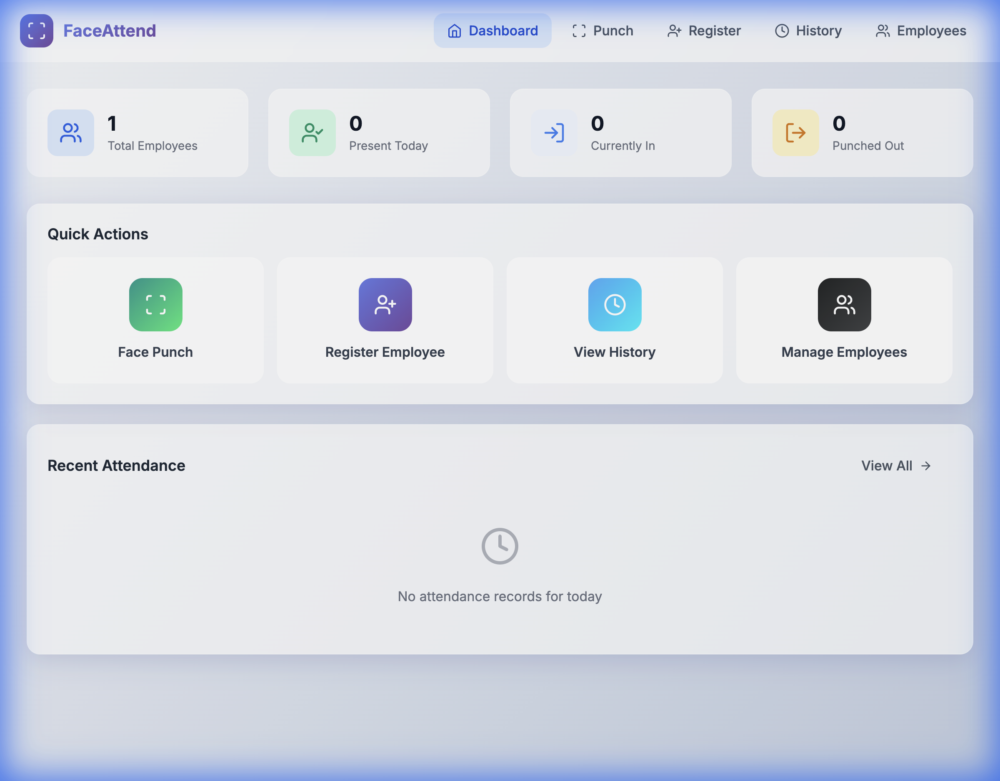
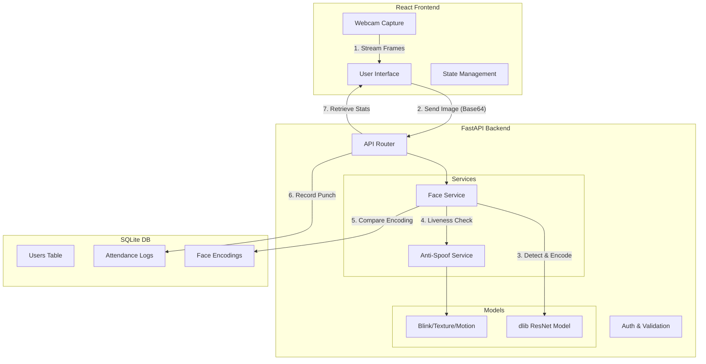

# Face Authentication Attendance System

A modern, production-grade face recognition-based attendance system with anti-spoofing capabilities. Features real-time face detection, liveness checking, and intelligent attendance tracking.



## 📋 Table of Contents
- [System Architecture](#system-architecture) (Mermaid Diagram)
- [Features](#features)
- [Tech Stack](#tech-stack)
- [Prerequisites](#prerequisites)
- [Installation & Setup](#installation--setup)
    - [Backend Setup](#1-backend-setup)
    - [Frontend Setup](#2-frontend-setup)
- [Usage Guide](#usage-guide)
- [Troubleshooting](#troubleshooting)
- [API Documentation](#api-documentation)

---

## System Architecture

The following diagram illustrates the data flow and component interaction:



---

## Features

| Feature | Description |
|---------|-------------|
| **👤 Face Registration** | Captures 5 images from different angles to create a robust face profile. |
| **🎯 High-Accuracy Recognition** | Uses `dlib`'s ResNet model with 99.38% accuracy on LFW benchmark. |
| **🛡️ Anti-Spoofing** | Prevents phone/photo attacks using blink detection, texture analysis, and motion checks. |
| **⚡ Contactless Auto-Punch** | Automatically marks attendance when a registered face is detected for 3 consecutive frames. |
| **📊 Analytics Dashboard** | Real-time overview of present/absent employees and recent activity. |
| **🌙 Modern UI** | Glassmorphism-inspired design with dark mode aesthetics and responsive layout. |

---

## Tech Stack

### Backend
- **Framework**: FastAPI (Python)
- **Face Recognition**: `face_recognition`, `dlib`, `opencv-python`
- **Database**: SQLite with SQLAlchemy ORM
- **Validation**: Pydantic

### Frontend
- **Framework**: React.js (Vite)
- **Styling**: Vanilla CSS (Glassmorphism), Lucide React Icons
- **HTTP Client**: Axios/Fetch
- **Camera**: `react-webcam`

---

## Prerequisites

Before starting, ensure you have:
1.  **Python 3.8+** (Recommended: 3.9 or 3.10)
2.  **Node.js 16+** and **npm**
3.  **CMake** (Required for compiling `dlib`)
    - *Mac*: `brew install cmake`
    - *Windows*: Download from cmake.org
    - *Linux*: `sudo apt-get install cmake`

---

## Installation & Setup

### 1. Backend Setup

```bash
# Navigate to backend directory
cd face-attendance-system/backend

# Create a virtual environment
python3 -m venv venv
source venv/bin/activate  # Windows: venv\Scripts\activate

# Install dependencies
# Note: This may take time as it compiles dlib
pip install -r requirements.txt

# Start the server
python -m uvicorn main:app --reload --host 0.0.0.0 --port 8000
```

> **Note**: If you face issues installing `face_recognition`, ensure CMake is installed.

### 2. Frontend Setup

```bash
# Open a new terminal and navigate to frontend
cd face-attendance-system/frontend

# Install node modules
npm install

# Start the development server
npm run dev
```

Open http://localhost:3000 in your browser.

## API Endpoints

### Users
- `POST /users/` - Create new user
- `GET /users/` - List all users
- `GET /users/{id}` - Get user details
- `POST /users/register-face` - Register face encodings
- `DELETE /users/{id}` - Delete user

### Attendance
- `POST /attendance/punch` - Smart punch (in/out)
- `POST /attendance/recognize` - Recognize face without punch
- `GET /attendance/history` - Get attendance logs
- `GET /attendance/today` - Today's attendance
- `GET /attendance/stats/today` - Today's statistics
- `POST /attendance/liveness-check` - Verify liveness

## System Architecture

```
┌─────────────────────────────────────────────────────────────┐
│                    React Frontend                            │
│  ┌─────────┐ ┌─────────┐ ┌─────────┐ ┌─────────┐           │
│  │Dashboard│ │ Punch   │ │Register │ │ History │           │
│  └────┬────┘ └────┬────┘ └────┬────┘ └────┬────┘           │
│       └───────────┴───────────┴───────────┘                 │
│                          │ REST API                          │
├──────────────────────────┼──────────────────────────────────┤
│                    FastAPI Backend                           │
│  ┌─────────────────┐ ┌─────────────────┐                    │
│  │  Face Service   │ │ Anti-Spoof Svc  │                    │
│  │  - Detection    │ │ - Blink detect  │                    │
│  │  - Encoding     │ │ - Texture check │                    │
│  │  - Recognition  │ │ - Motion verify │                    │
│  └────────┬────────┘ └────────┬────────┘                    │
│           └───────────┬───────┘                              │
│                 ┌─────┴─────┐                                │
│                 │  SQLite   │                                │
│                 │ Database  │                                │
│                 └───────────┘                                │
└─────────────────────────────────────────────────────────────┘
```

## Face Recognition Approach

### Model Used
- **face_recognition library** (dlib-based)
- Uses ResNet with 128D face embeddings
- Pre-trained on millions of faces

### Training Process
- No training required - uses pre-trained model
- Registration captures 5 face images from different angles
- Generates and stores 128D embeddings per image

### Recognition Process
1. Detect face using HOG (Histogram of Oriented Gradients)
2. Extract 128D face encoding
3. Compare with stored encodings using cosine similarity
4. Match if distance < 0.45 (configurable threshold)

## Anti-Spoofing Measures

| Technique | How It Works | Effectiveness |
|-----------|--------------|---------------|
| **Blink Detection** | Monitors Eye Aspect Ratio (EAR) to detect natural blinking | ~75% vs printed photos |
| **Texture Analysis** | Uses LBP (Local Binary Patterns) to detect paper/screen texture | ~70% vs basic attacks |
| **Motion Detection** | Checks for natural micro-movements between frames | ~80% vs static photos |
| **Multi-Frame Verification** | Validates face across 3-5 consecutive frames | Reduces false positives |

## Accuracy Expectations

| Scenario | Expected Accuracy |
|----------|-------------------|
| Good lighting (>100 lux) | 95-99% |
| Moderate lighting | 85-95% |
| Poor lighting (<50 lux) | 60-80% |
| With glasses | 90-95% |
| Face partially visible | 70-85% |

## Known Failure Cases

1. **Very poor lighting** - Recognition accuracy drops significantly
2. **Face occlusion >40%** - Masks, scarves, or large sunglasses
3. **Identical twins** - Cannot distinguish between identical twins
4. **Extreme angles** - Face turned more than 45 degrees
5. **High-quality printed photos** - May bypass basic anti-spoofing
6. **Professional makeup/prosthetics** - Can alter face structure

## Configuration

Edit `backend/config.py` to adjust:

```python
# Face Recognition
FACE_RECOGNITION_TOLERANCE = 0.45  # Lower = stricter
MIN_FACE_CONFIDENCE = 0.85

# Anti-Spoofing
BLINK_THRESHOLD = 0.25
LIVENESS_FRAMES_REQUIRED = 3

# Attendance Rules
MIN_HOURS_FOR_PUNCHOUT = 6
```

## Project Structure

```
face-attendance-system/
├── backend/
│   ├── main.py              # FastAPI app
│   ├── config.py            # Settings
│   ├── database.py          # DB connection
│   ├── models.py            # SQLAlchemy models
│   ├── schemas.py           # Pydantic schemas
│   ├── routes/
│   │   ├── users.py         # User endpoints
│   │   └── attendance.py    # Attendance endpoints
│   └── services/
│       ├── face_service.py      # Face recognition
│       └── anti_spoof_service.py # Liveness detection
│
└── frontend/
    ├── src/
    │   ├── App.jsx
    │   ├── api.js           # API client
    │   ├── index.css        # Global styles
    │   ├── components/
    │   │   ├── Header.jsx
    │   │   └── WebcamCapture.jsx
    │   └── pages/
    │       ├── Dashboard.jsx
    │       ├── Punch.jsx
    │       ├── Register.jsx
    │       ├── History.jsx
    │       └── Employees.jsx
    └── package.json
```

## License

MIT License
