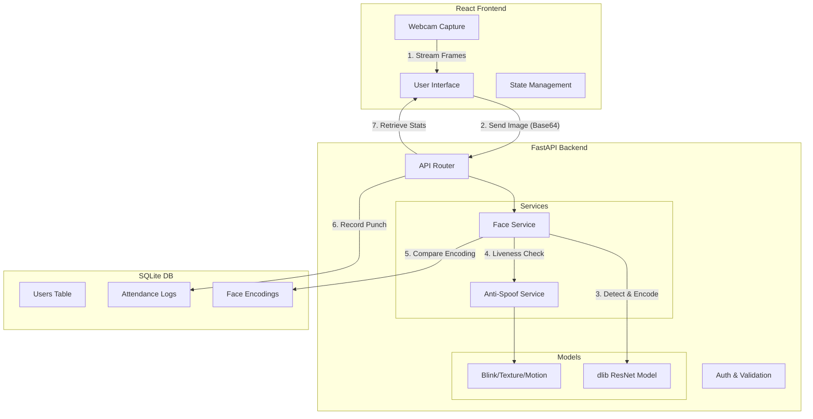

# Face Authentication Attendance System

A modern, production-grade face recognition attendance system built with **FastAPI** and **React**. Features real-time face detection, liveness checking (anti-spoofing), and intelligent attendance tracking.


## 📋 Table of Contents
- [System Architecture](#system-architecture) (Mermaid Diagram)
- [Features](#features)
- [Tech Stack](#tech-stack)
- [Prerequisites](#prerequisites)
- [Installation & Setup](#installation--setup)
    - [Backend Setup](#1-backend-setup)
    - [Frontend Setup](#2-frontend-setup)
- [Usage Guide](#usage-guide)
- [Troubleshooting](#troubleshooting)
- [API Documentation](#api-documentation)

---

## System Architecture

The following diagram illustrates the data flow and component interaction:



---

## Features

| Feature | Description |
|---------|-------------|
| **👤 Face Registration** | Captures 5 images from different angles to create a robust face profile. |
| **🎯 High-Accuracy Recognition** | Uses `dlib`'s ResNet model with 99.38% accuracy on LFW benchmark. |
| **🛡️ Anti-Spoofing** | Prevents phone/photo attacks using blink detection, texture analysis, and motion checks. |
| **⚡ Contactless Auto-Punch** | Automatically marks attendance when a registered face is detected for 3 consecutive frames. |
| **📊 Analytics Dashboard** | Real-time overview of present/absent employees and recent activity. |
| **🌙 Modern UI** | Glassmorphism-inspired design with dark mode aesthetics and responsive layout. |

---

## Tech Stack

### Backend
- **Framework**: FastAPI (Python)
- **Face Recognition**: `face_recognition`, `dlib`, `opencv-python`
- **Database**: SQLite with SQLAlchemy ORM
- **Validation**: Pydantic

### Frontend
- **Framework**: React.js (Vite)
- **Styling**: Vanilla CSS (Glassmorphism), Lucide React Icons
- **HTTP Client**: Axios/Fetch
- **Camera**: `react-webcam`

---

## Prerequisites

Before starting, ensure you have:
1.  **Python 3.8+** (Recommended: 3.9 or 3.10)
2.  **Node.js 16+** and **npm**
3.  **CMake** (Required for compiling `dlib`)
    - *Mac*: `brew install cmake`
    - *Windows*: Download from cmake.org
    - *Linux*: `sudo apt-get install cmake`

---

## Installation & Setup

### 1. Backend Setup

```bash
# Navigate to backend directory
cd face-attendance-system/backend

# Create a virtual environment
python3 -m venv venv
source venv/bin/activate  # Windows: venv\Scripts\activate

# Install dependencies
# Note: This may take time as it compiles dlib
pip install -r requirements.txt

# Start the server
python -m uvicorn main:app --reload --host 0.0.0.0 --port 8000
```

> **Note**: If you face issues installing `face_recognition`, ensure CMake is installed.

### 2. Frontend Setup

```bash
# Open a new terminal and navigate to frontend
cd face-attendance-system/frontend

# Install node modules
npm install

# Start the development server
npm run dev
```

The application will be available at **http://localhost:3000**.

---

## Usage Guide

### Step 1: Register Employees
1.  Go to the **Register** page.
2.  Enter Employee ID, Name, and optional details.
3.  Allow camera access.
4.  Follow the voice/text prompts to capture 5 angles:
    - Center
    - Turn Left
    - Turn Right
    - Look Up
    - Look Down
5.  Click **Complete Registration**.

### Step 2: Mark Attendance
1.  Go to the **Punch** page.
2.  Simply look at the camera.
3.  The system will:
    - Detect your face
    - Verify liveness (blink/motion)
    - **Automatically punch you in/out** once verified.
4.  Alternatively, click the **Camera Button** for manual capture.

### Step 3: View History
1.  Go to **History** to see all logs.
2.  Filter by date or employee name.
3.  Export data to CSV for payroll/reporting.

---

## Troubleshooting

### `dlib` installation fails
Ensure CMake is installed. If on macOS:
```bash
brew install cmake
pip install dlib --verbose
```

### `face_recognition_models` not found
This can happen on newer Python versions. Run:
```bash
pip install git+https://github.com/ageitgey/face_recognition_models
```

### Camera not working
- Ensure browser has permission to access the camera.
- Check if another application (Zoom/Teams) is using the camera.
- Access via `localhost` or `https` (browsers block camera on `http` unless it's localhost).

---

## API Documentation

The backend provides interactive Swagger documentation.
Visit **http://localhost:8000/docs** to test endpoints directly.

### Key Endpoints
- `POST /users/` - Register new user meta-data
- `POST /users/register-face` - Upload face training images
- `POST /attendance/punch` - Recognize face and mark attendance
- `GET /attendance/stats/today` - Get daily dashboard statistics

---
Built with ❤️ 
